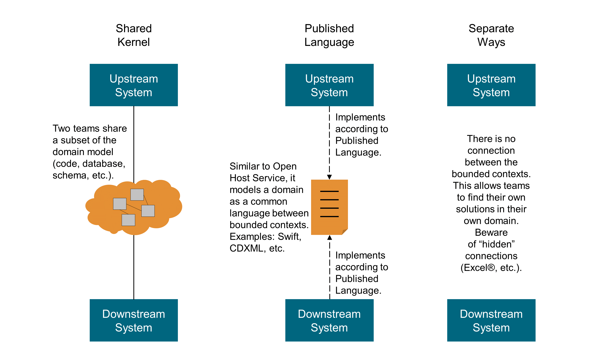

# Great quotes for the concept of Published Language 

Mission of this overview is to bring great quotes for the concept of the Published Language, in order to get a better understandig of this fundamental DDD integration pattern.

> The translation between the models of two bounded contexts requires a common language. Use a well-documented shared language that can express the necessary domain information as a common medium of communication, translating as necessary into and out of that language. Published Language is often combined with Open Host Service. [Evans 2003](https://pubs.opengroup.org/architecture/o-aa-standard/DDD-strategic-patterns.html#_midway_patterns)

*last update: 12.06.2023*

##### [design-practice-repository by Olaf Zimmermann 2023](https://socadk.github.io/design-practice-repository/activities/DPR-StrategicDDD.html)
* Published Language (PL): “The interacting bounded contexts agree on a **common language** (for example a bunch of XML schemas over an enterprise service bus) by which they can interact with each other.”

___

##### [Domain-Driven Design, Definitions and Pattern Summaries by Eric Evans 2015](https://www.domainlanguage.com/wp-content/uploads/2016/05/DDD_Reference_2015-03.pdf)
* Many **industries establish	published	languages	in the form	of data interchange standards**. Project teams also develop their own for use within their organization.

___

##### [Implementing Domain-Driven Design by Vaughn Vernon 2013](https://ptgmedia.pearsoncmg.com/images/9780321834577/samplepages/0321834577.pdf)
* p115:  REST also has the advantage of producing hypermedia representations, which facilitates HATEOAS. Hypermedia makes a Published Language very dynamic and interactive, enabling clients to navigate to sets of linked resources. The Language may be published **using standard and/or custom media types**. 

___

##### [Learning Domain-Driven Design by Vlad Khononov 2021](https://www.amazon.com/Learning-Domain-Driven-Design-Aligning-Architecture/dp/1098100131)
* p88: The supplier’s public interface is not intended to conform to its ubiquitous language. Instead, it is intended to expose a protocol convenient for the consumers, expressed in an **integration-oriented language**. As such, the public protocol is called the published language. 
* p194: Moreover, translating messages to the published language enables differentiating between **private events** that are intended for the bounded context’s internal needs and **public events** that are designed for integration with other bounded contexts. 
* p305 : Introducing the integration-oriented model, the published language, reduces the system’s global complexity. First, it allows us to evolve the service’s implementation without impacting its consumers: the new implementation model can be translated to the existing published language. Second, the published language exposes a more **restrained model**. It is designed around integration needs. It encapsulates the complexity of the implementation that is not relevant to the service’s consumers. For example, it can expose less data and in a more convenient model for consumers. 
* Furthermore, a published language describes **only what is encompassed by its bounded context, and not the whole system, as in the case of a CDM** (https://github.com/vladikk/learning-ddd/issues/2#issuecomment-1054147883)

___

##### [Domain-Driven Design Crew Context Mapping](https://github.com/ddd-crew/context-mapping)
* Widely known examples for a Published Language are **iCalendar or vCard**. Published language is often combined with an open-host service.

___

##### [BPM2DDD: A Systematic Process for Identifying Domains from Business Processes Models](https://www.mdpi.com/2674-113X/1/4/18/htm)
* The Document printing relationship type was defined as open host service and published language, as this is a **generic** context that can be used by any other context inside the organisation.

___

##### [Opus: DDD Concepts and Patterns – Context Map](https://opus.ch/ddd-concepts-and-patterns-context-map/)
* Further development of the open host service may lead to (the use of) a published language that has it’s own bounded context. The language could be a **model defined by some industry association or state** for example.

___

##### [Herberto Graca: DDD.14 – Maintaining model integrity](https://herbertograca.com/2016/02/05/ddd-14-maintaining-model-integrity/)
* Therefore we need a common, standard, communication Interchange Language that any system con use to communicate with our system, we need a published language:
If possible, use an **industry standard language**;

___

##### [Strategic Domain-Driven Design](https://dev.to/peholmst/strategic-domain-driven-design-3e87)
* Real world examples of published languages are **MathML** for representing mathematical formulas and **GML** for representing geographical features in geographical information systems.

___

##### [An Introduction to Domain Driven Design by Dan Haywood](https://www.methodsandtools.com/archive/archive.php?id=97)
* With a published language we start off with the BCs establishing a common standard by which they can interact; neither owns this language, rather it is owned by the enterprise in which they reside (**it might even be an industry standard**).

___

##### [Introduction to Context Mapping by Michael Plöd](https://www.innoq.com/de/talks/2022/06/introduction-to-context-mapping-ddd-europe-2022/)
* Sometimes defined by a **consortium** of the most important stakeholders / teams. Examples: iCalendar, vCard, ZugFerd (slide 59).

___

##### [Microservices love Domain-Driven Design! Why and how? by Michael Plöd](https://youtu.be/E6zhkC58XQ8?t=2687)
* A published language is more than just an interface xsd or OpenAPI descripten: it should be governed by a domain steering committee - it is an industry standard set by a consortium.

___
